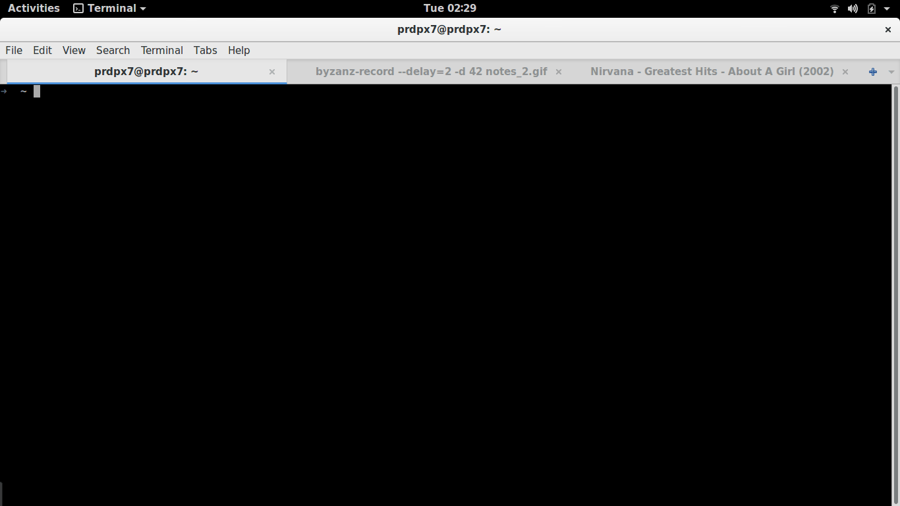

# notes-cli
> A simple CLI app to take notes on markdown files

## Installation
* Download the binary
    ```
    wget https://raw.githubusercontent.com/prdpx7/notes-cli/master/notes
    ```
* And copy into the /usr/local/bin directory
    ```
    sudo cp notes /usr/local/bin/notes
    ```
## Usage
```
notes - A simple note-taking app
Usage: notes [OPTIONS]
Options:
	write -  write in markdown file automatically created with today's date stamp
	read - browse all notes in terminal file browser
	sync - upload all markdown files to your github as Private Gist
Example:
notes write
notes read
notes sync
```

